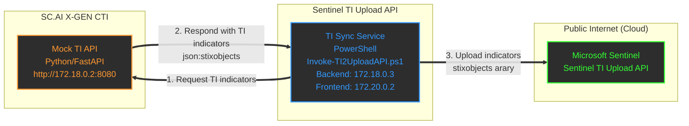

# TI Sync Service - SC.AI X-GEN API <-> Microsoft Sentinel

This solution fetches threat intelligence indicators from a Mock TI API and uploads them to Microsoft Sentinel using the TI Upload API (Preview).

## Architecture (containers & cloud)


```python
     container                  container                   cloud
┌─────────────────┐       ┌──────────────────┐       ┌─────────────────┐
│   Mock TI API   │◀──1──│  TI Sync Service  │──3──▶│    Microsoft    │
│ (Python/FastAPI)│       │   (PowerShell)   │       │    Sentinel     │
│                 │──2──▶│                   │      │                 │
└─────────────────┘       └──────────────────┘       └─────────────────┘
http://172.18.0.2:8080    Invoke-TI2UploadAPI.ps1     Sentinel TI Upload API (preview)

    [SC.AI X-GEN API ENDPOINTS NETWORK]
172.18.0.2/24 <-- INTERNAL --> 172.18.0.3/24
                     [172.18 cannot talk 172.20]
                               172.20.0.2/24 <-- PUBLIC --> 0.0.0.0
                                [MICROSOFT SENTINEL TI UPLOAD API]

Flow:
1. TI Sync Service request TI indicators from Mock TI API via API (1)
2. Mock TI API responds with TI indicators (json:stixobjects[]) (2)
3. TI Sync Service uploads indicators (stixobjects[]) to Microsoft Sentinel (3)
```

## Features

- ✅ Fetches STIX 2.1 indicators from Mock TI API
- ✅ Handles pagination (max 100 indicators per Sentinel upload)
- ✅ Supports both single and continuous sync modes
- ✅ Azure AD authentication with client credentials
- ✅ Test mode for dry runs
- ✅ Docker support for containerized deployment
- ✅ Detailed logging and progress tracking

## Prerequisites

- [Docker](https://www.docker.com/)
- PowerShell 5.1 or higher
- Azure subscription with Microsoft Sentinel enabled
- Azure AD App Registration with appropriate permissions
- Mock TI API running and accessible
- `.env` file with Azure credentials

## Quick Start

### 1. Configure Environment

Ensure your `.env` file contains:

```env
# Azure Configuration
AZURE_CLIENT_ID=your-client-id
AZURE_CLIENT_SECRET=your-client-secret
AZURE_TENANT_ID=your-tenant-id
AZURE_WORKSPACE_ID=your-sentinel-workspace-id

# Mock API Configuration (example & optional - perhaps even b64 decode it ;)
API_KEYS=QUxMIFVSIEJBU0UgQU5EIEFQSSdTIEFSRSBCRUxPTkcgVE8gVVMh
```

## Usage Examples

### Preferred and optimized method
### Build and Run with Docker Compose

```bash
# Start both Mock API and Sync Service
docker compose up --build -d
```

```bash
# View logs
docker compose logs -f
docker compose logs -f ti-sync-service
```
```bash
# Stop services
docker compose down --rmi all -v
docker system prune -f
```

### Continuous Sync

```powershell
# Run continuous sync every 30 minutes
Start-TISyncFromMockAPI -IntervalMinutes 30

# Run once (useful for cron jobs)
Start-TISyncFromMockAPI -RunOnce
```

### Using the Run Script

```powershell
# Single sync
.\run.ps1 -Mode Single

# Continuous sync every 30 minutes
.\run.ps1 -Mode Continuous -IntervalMinutes 30

# Test mode
.\run.ps1 -Mode Test

# Start Docker containers
.\run.ps1 -Mode Docker
```

## Docker Deployment

### Run Sync Service Only

```bash
# Build the image
docker build -t ti-sync-service:latest .

# Run container (mount .env file)
docker run -d \
  --name ti-sync \
  -v $(pwd)/.env:/app/.env:ro \
  -e INTERVAL_MINUTES=60 \
  -e MOCK_API_URL=http://192.168.10.27:8080 \
  ti-sync-service:latest
```

## API Endpoints

### Mock TI API

- **Health Check**: `GET /healthz`
- **Display API Endpoints**: `GET /routes`
  
- **Get Indicators**: `GET /api/v1/indicators`
  - Headers: `X-API-Key: {api_key}`
  - Response: `{ sourcesystem, stixobjects[] }`

### Microsoft Sentinel TI Upload API

- **Upload Endpoint**: `POST /workspaces/{workspaceId}/threat-intelligence-stix-objects:upload`
- **API Version**: `2024-02-01-preview`
- **Max Indicators**: 100 per request
- **Documentation**: [Microsoft Learn](https://learn.microsoft.com/en-us/azure/sentinel/stix-objects-api)

## Parameters

### Invoke-TI2UploadAPI

| Parameter | Description | Default |
|-----------|-------------|---------|
| `-EnvFile` | Path to .env file | `.\.env` |
| `-MockApiUrl` | Mock TI API base URL | `http://172.18.0.2:8080` |
| `-ApiKey` | API key for Mock API | Read from .env |
| `-MaxIndicatorsPerUpload` | Max indicators per batch | 100 |
| `-ShowProgress` | Show detailed progress | False |
| `-TestMode` | Dry run without upload | False |
| `-SaveToFile` | Save fetched indicators | False |

### Start-TISyncFromMockAPI

| Parameter | Description | Default |
|-----------|-------------|---------|
| `-IntervalMinutes` | Sync interval in minutes | 60 |
| `-RunOnce` | Run single sync only | False |
| `-EnvFile` | Path to .env file | `.\.env` |
| `-MockApiUrl` | Mock TI API base URL | `http://192.168.10.27:8080` |

## Troubleshooting

### Common Issues

1. **Authentication Failed**
   - Verify Azure credentials in `.env`
   - Check App Registration permissions
   - Ensure Sentinel Contributor role is assigned

2. **Mock API Connection Failed**
   - Verify Mock API is running: `curl http://192.168.10.27:8080/healthz`
   - Check API key if authentication is enabled
   - Verify network connectivity

3. **Upload Failed with 400 Bad Request**
   - Check indicator format (STIX 2.1 compliance)
   - Verify max 100 indicators per batch
   - Review Sentinel API documentation

4. **Rate Limiting**
   - Automatic 500ms delay between batches
   - Adjust `IntervalMinutes` for continuous sync

### Debug Mode

```powershell
# Enable verbose output
$VerbosePreference = "Continue"
Invoke-TI2UploadAPI -ShowProgress

# Save indicators for inspection
Invoke-TI2UploadAPI -TestMode -SaveToFile
```

## Security Considerations

- Store `.env` file securely (not in version control)
- Use managed identities in production (Azure)
- Rotate API keys and client secrets regularly
- Monitor upload logs for anomalies
- Implement proper error handling and alerting

## Performance

- Mock API can generate 10-25 indicators per cycle
- Sentinel accepts max 100 indicators per upload
- Batching handles large indicator sets efficiently
- Recommended sync interval: 30-60 minutes

## License

This is a demonstration/mock solution for educational purposes.

## Support

For issues related to:
- Mock TI API: Check `generator.py` and FastAPI logs
- Sync Service: Review PowerShell error messages
- Sentinel API: Consult [Microsoft documentation](https://learn.microsoft.com/en-us/azure/sentinel/stix-objects-api)
